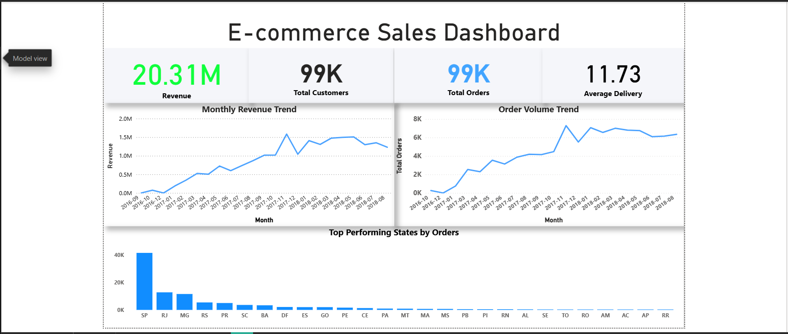
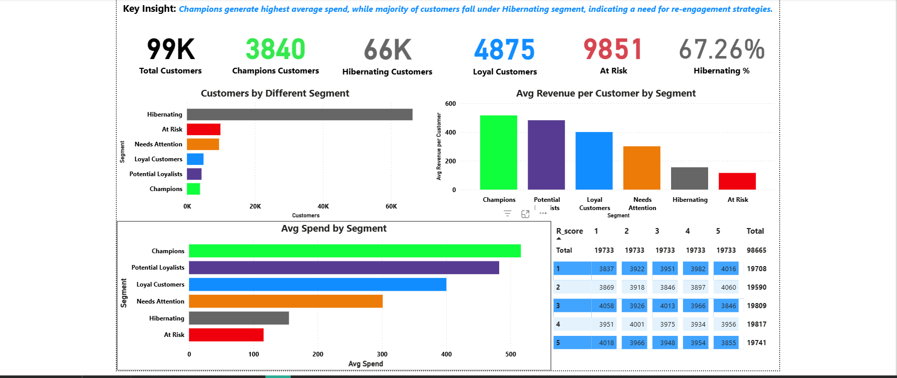

# 📊 E-Commerce Sales & Customer Segmentation (RFM)

> End-to-end analysis of an e-commerce dataset to uncover revenue trends and segment customers using **RFM (Recency, Frequency, Monetary)** for targeted business actions.

---

## 🔎 Overview

This project analyzes transactional e-commerce data to:

* Track **revenue & order trends**
* Identify **top products, states, and customers**
* Segment customers into actionable groups (Champions, Loyal, At Risk, etc.)
* Support **data-driven marketing & retention strategies**

---

## 🧰 Tech Stack

* **SQL (MySQL)** — data modeling & analysis
* **Python (Pandas, NumPy)** — cleaning & feature engineering *(optional if used)*
* **Power BI** — interactive dashboards & storytelling

---

## 📂 Repository Structure

```id="tree01"
Ecommerce-RFM-Dashboard/
│
├── Dashboard/
│   ├── E-Commerce Sales Dashboard.png
│   └── Customer Segmentation (RFM).png
│
├── SQL/
│   └── Brazilian SQL.sql
│
├── Power BI/                 # (optional)
│   └── Brazilian Data Set.pbix
│
└── README.md
```

---

## 📈 Key Insights

* 💰 **Total Revenue:** ~20.3M
* 👥 **Customers:** ~99K
* 🔁 **Repeat Buyers:** Identified via frequency analysis
* 📉 **Largest Segment:** *Hibernating* (re-engagement opportunity)
* ⭐ **High-Value Segment:** *Champions* (highest avg. spend)

---

## 📊 Dashboard Highlights

### 🔹 Sales Overview

* Monthly **Revenue Trend**
* **Order Volume** over time
* **Top States** by orders

### 🔹 RFM Segmentation

* Segment distribution (Champions, Loyal, At Risk, etc.)
* **Avg Spend** by segment
* **Revenue contribution** by segment

---

## 🧠 RFM Methodology

Customers are scored on:

* **Recency (R):** How recently they purchased
* **Frequency (F):** How often they purchase
* **Monetary (M):** How much they spend

Segments enable:

* 🎯 Targeted campaigns (e.g., upsell Champions)
* 🔁 Retention strategies (re-activate At Risk/Hibernating)
* 💡 Better allocation of marketing budget

---

## 🗃️ Data Modeling (SQL)

* Designed relational schema: `orders`, `order_items`, `products`, `order_payments`
* Cleaned null/empty timestamps using `NULLIF`
* Built analytical queries for:

  * Revenue & AOV
  * Monthly trends
  * Top categories & customers
  * Repeat purchase behavior

> See full queries in: **SQL/Brazilian SQL.sql**

---

## 🚀 How to Use

1. Open the SQL file and run in MySQL to reproduce analysis
2. Open `.pbix` in Power BI to explore the dashboard
3. Use screenshots below for quick preview

---

## 🖼️ Dashboard Preview

### Sales Dashboard



### RFM Segmentation



---

## 🧩 Business Impact

* Identifies **high-value customers** for retention & upsell
* Highlights **churn-risk segments** for re-engagement
* Tracks **growth trends** for strategic planning

---


## 👤 Author

**Shubham Pathak**
Data Analyst (SQL | Power BI | Python)

⭐ If you found this useful, consider giving it a star!
